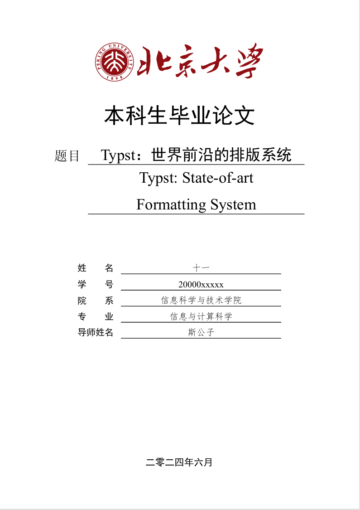

# PKUTHSS-Typst

PKU本科生论文模板（~~更适合本科生宝宝体质~~）。本模板产生的论文已在2024年被过本科生教务认可。

Typst template for **undergraduate thesis** in Peking University (PKU).The thesis produced using this template has been recognized by the Undergraduate Education Dean in 2024.

（从[博士论文版本](https://github.com/pku-typst/pkuthss-typst)修改而来，感谢原作者）

(This version is changed from [PKU PhD thesis version](https://github.com/pku-typst/pkuthss-typst). Thank the original authors.)

The full PDF file is available [here](./build/thesis.pdf).

## Usage

- Install the latest version of [Typst](https://github.com/typst/typst)
- Download and extract the entire folder
- Modify `thesis.typ`
- Run `typst compile thesis.typ --font-path fonts` to compile the thesis

